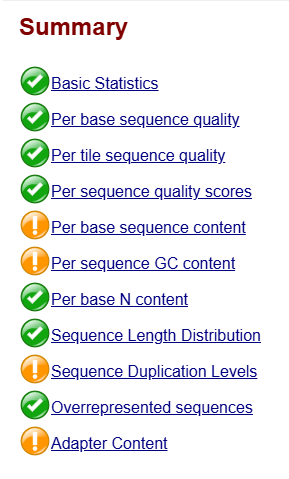
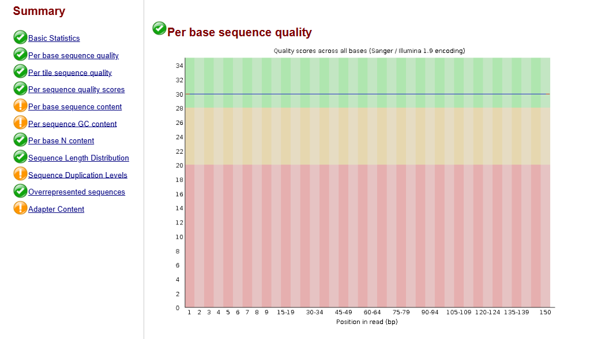
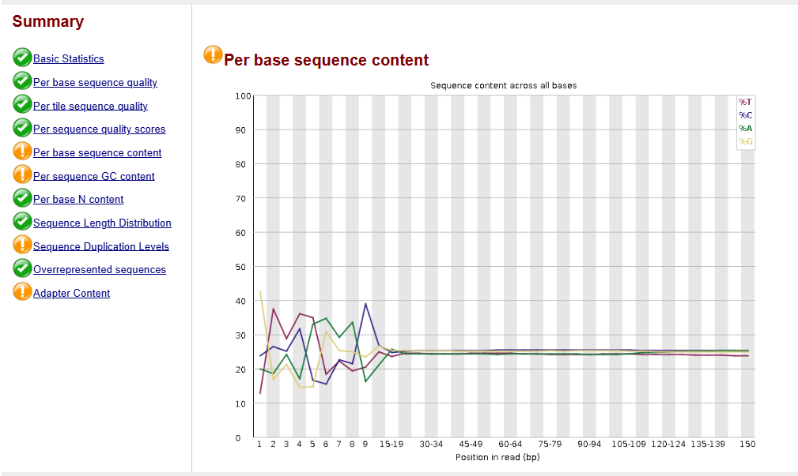
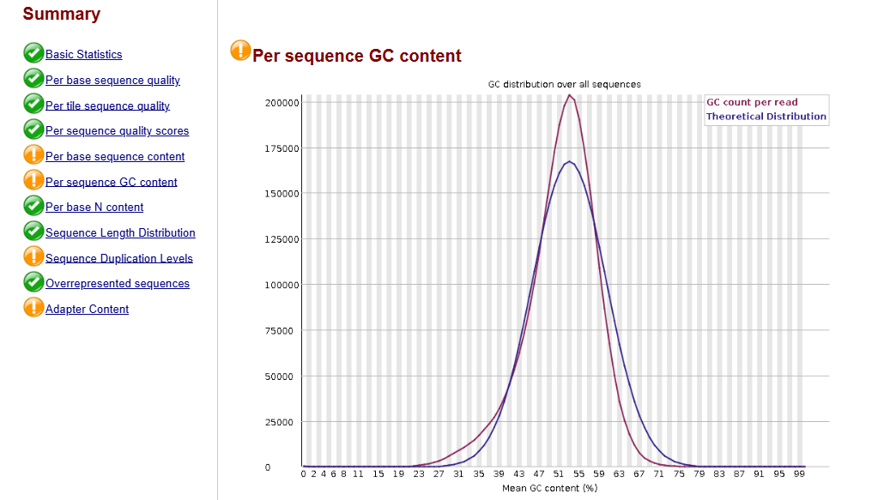
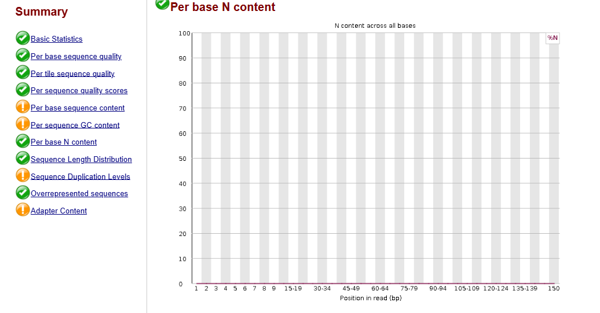
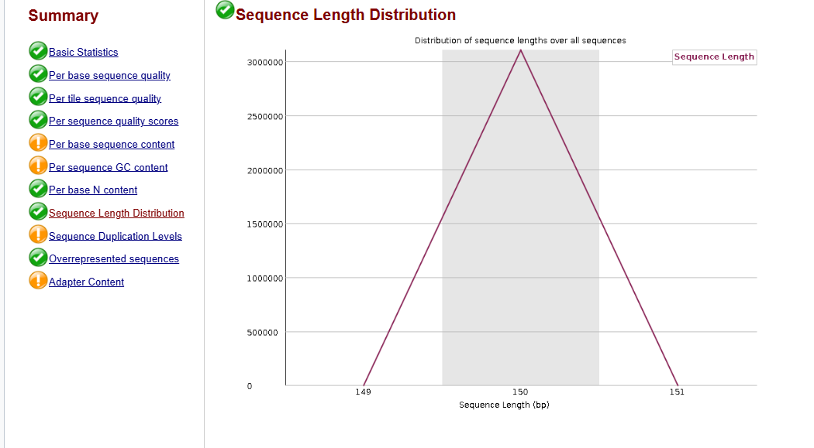

# Project 5 – RNA-Seq Quality Control (FastQC) Using Galaxy

## Overview

This project focuses on the quality assessment of publicly available RNA-Seq data using the FastQC tool implemented on the Galaxy platform. Before downstream transcriptomic analysis, sequencing reads must be evaluated to ensure they are of sufficient quality for reliable alignment and differential gene expression analysis.

FastQC generates comprehensive quality metrics, including sequence quality, GC content, duplication levels, adapter contamination, and sequence composition.

---

# Objective

- Evaluate the quality of RNA-Seq reads.
- Identify sequencing artifacts.
- Detect adapter contamination.
- Assess base quality across sequencing reads.
- Determine whether preprocessing (trimming) is required before alignment.

---

# Dataset Information

| Parameter | Value |
|-----------|-------|
| Database | NCBI SRA |
| Accession | SRR2584863 |
| Organism | Homo sapiens |
| Platform | Illumina |
| Read Length | 150 bp |
| Total Reads | 3,106,518 |
| Total Bases | 465.9 Mb |

---

# Software Used

- Galaxy
- FastQC

---

# Workflow

NCBI SRA

↓

Download FASTQ

↓

Upload to Galaxy

↓

FastQC Quality Assessment

↓

Interpret Quality Metrics

↓

Proceed to Read Trimming (if required)

↓

RNA-Seq Alignment

---

# Galaxy Upload

The RNA-Seq FASTQ dataset was successfully uploaded into the Galaxy platform and used as input for FastQC analysis.

---

# FastQC Summary

The FastQC summary provides an overview of all quality control modules.

**PASS**
- Basic Statistics
- Per Base Sequence Quality
- Per Tile Sequence Quality
- Per Sequence Quality Scores
- Per Base N Content
- Sequence Length Distribution
- Overrepresented Sequences

**WARNING**
- Per Base Sequence Content
- Per Sequence GC Content
- Sequence Duplication Levels
- Adapter Content

---

# 1. Basic Statistics

This module summarizes the sequencing dataset, including read length, sequencing platform, total reads, GC content, and total bases.

### Interpretation

- Total Reads: 3,106,518
- Read Length: 150 bp
- GC Content: 50%
- No poor-quality reads detected.

Result: **PASS**

---

# 2. Per Base Sequence Quality

This module evaluates Phred quality scores across every base position.

### Interpretation

The quality remained consistently above Q30 across the entire read length, indicating excellent sequencing quality.

Result: **PASS**

---

# 3. Per Sequence Quality Scores

This module evaluates the average quality score of every sequencing read.

### Interpretation

Nearly all reads possess high average quality scores, indicating reliable sequencing data.

Result: **PASS**

---

# 4. Per Base Sequence Content

This module compares nucleotide composition across each base position.

### Interpretation

Minor nucleotide bias is observed at the beginning of sequencing reads, which is commonly observed in RNA-Seq libraries.

Result: **WARNING**

---

# 5. Per Sequence GC Content

This module compares observed GC distribution with the theoretical distribution.

### Interpretation

The GC distribution is slightly shifted from the theoretical model, reflecting transcriptomic composition rather than contamination.

Result: **WARNING**

---

# 6. Sequence Duplication Levels

This module estimates duplicate sequencing reads.

### Interpretation

Moderate duplication levels are present, which are expected in highly expressed transcripts within RNA-Seq datasets.

Result: **WARNING**

---

# 7. Overrepresented Sequences

This module identifies sequences occurring at unusually high frequency.

### Interpretation

No significant overrepresented sequences were detected.

Result: **PASS**

---

# 8. Per Base N Content

This module evaluates ambiguous base calls (N).

### Interpretation

No ambiguous nucleotides were detected throughout sequencing reads.

Result: **PASS**

---

# 9. Sequence Length Distribution

This module evaluates read length consistency.

### Interpretation

All sequencing reads are exactly 150 bp in length, indicating uniform sequencing.

Result: **PASS**

---

# Overall Conclusion

The RNA-Seq dataset demonstrates excellent sequencing quality suitable for downstream transcriptomic analysis.

Although FastQC generated warnings for:

- Per Base Sequence Content
- GC Content
- Sequence Duplication Levels
- Adapter Content

these warnings are commonly observed in RNA-Seq datasets and do not necessarily indicate poor-quality sequencing. The consistently high base quality (Q30), absence of poor-quality reads, and lack of overrepresented sequences indicate that the dataset is suitable for downstream analysis.

---

# Skills Demonstrated

- RNA-Seq Quality Control
- FastQC Analysis
- Galaxy Workflow
- Quality Assessment of NGS Data
- Interpretation of FastQC Reports
- Bioinformatics Data Preprocessing

---
## Next Steps

The next phase of this project will include:

- Read trimming (if required)
- HISAT2 alignment
- Gene quantification using featureCounts
- Differential gene expression analysis
- Functional enrichment (GO and KEGG)
- Biological interpretation of results

