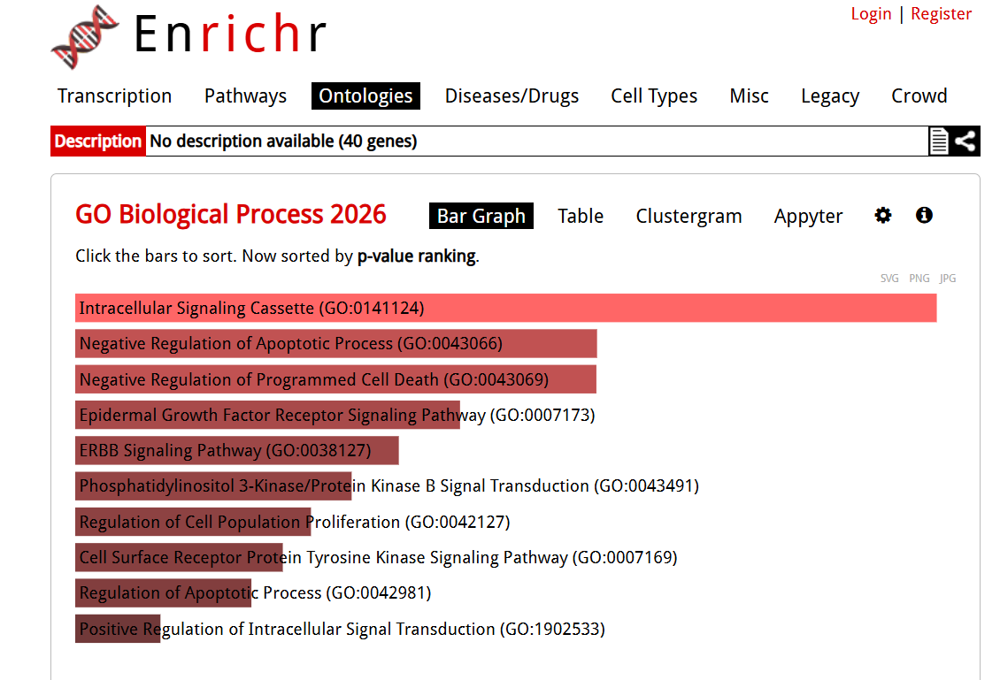
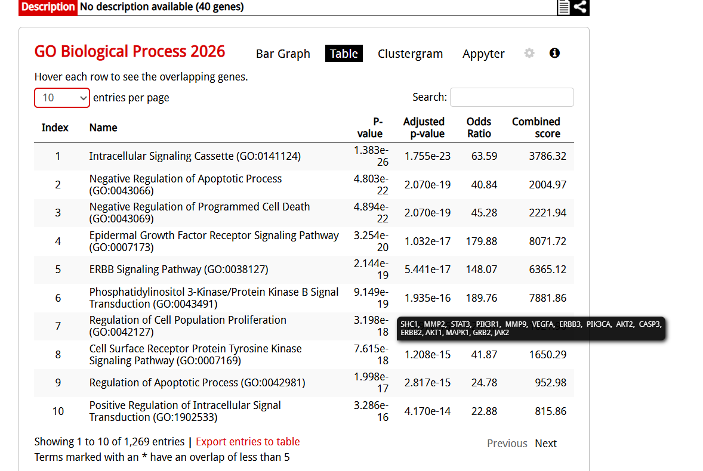
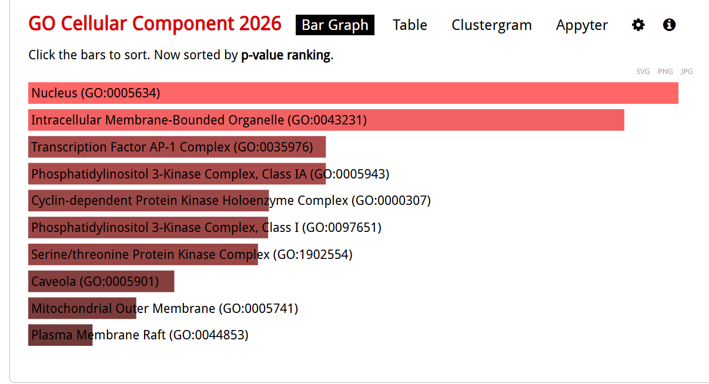
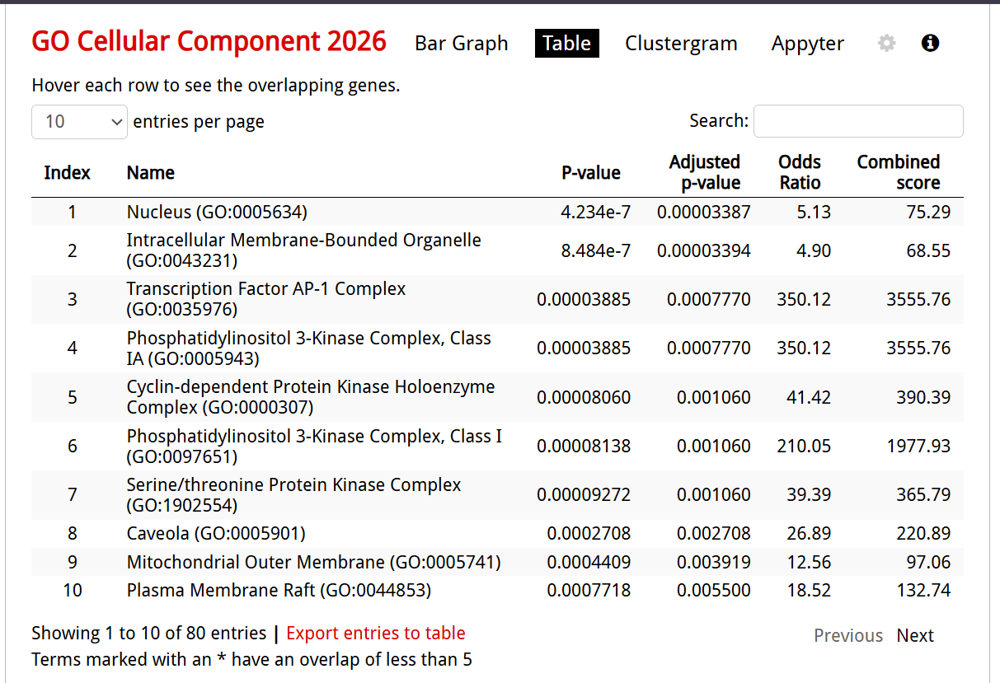
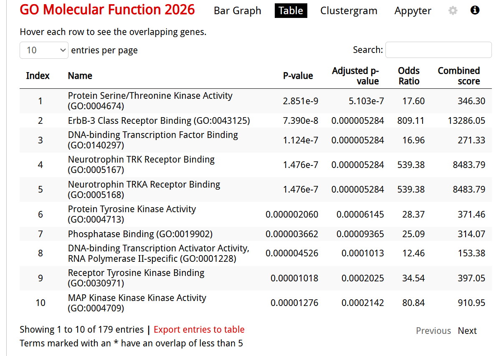
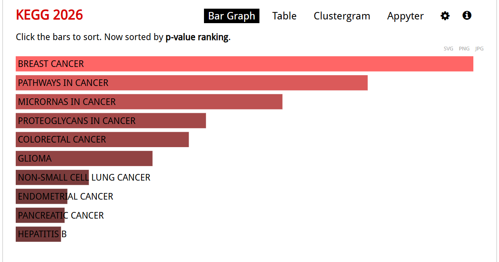
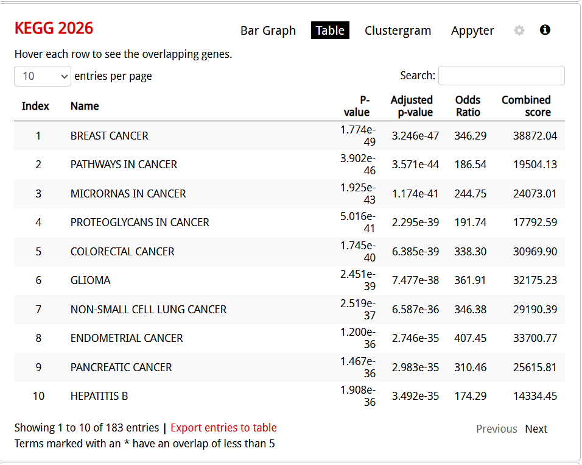

Project 7: Functional Enrichment Analysis (GO & KEGG)

Project Status

✅ Completed

---

 Background

High-throughput sequencing experiments often generate a large number of differentially expressed genes (DEGs). However, a list of genes alone does not explain the biological mechanisms involved in disease progression.

Functional enrichment analysis helps interpret these genes by identifying significantly enriched biological processes, molecular functions, cellular components, and signaling pathways. In this project, Gene Ontology (GO) and Kyoto Encyclopedia of Genes and Genomes (KEGG) pathway analysis were performed to understand the biological mechanisms associated with **HER2-positive breast cancer**.

---

 Objective

To identify the biological functions and signaling pathways significantly associated with HER2-positive breast cancer using Gene Ontology (GO) and KEGG pathway enrichment analysis.

---

 Dataset

A curated list of genes associated with HER2-positive breast cancer was used as the input for enrichment analysis.

Example genes include:

- ERBB2 (HER2)
- EGFR
- PIK3CA
- AKT1
- MTOR
- KRAS
- TP53
- BRCA1
- BRCA2
- MYC
- CCND1
- CDK4
- CDK6
- MAPK1
- MAPK3
- STAT3
- JUN
- FOS
- BCL2
- VEGFA

---

Software and Web Tools

- Enrichr
- ShinyGO
- DAVID
- KEGG Database
- Gene Ontology Database
- Microsoft Excel

---

 Methodology

The analysis was performed using the following workflow.

```
HER2-associated Gene List
            │
            ▼
Gene Annotation
            │
            ▼
Gene Ontology Analysis
(Biological Process,
Molecular Function,
Cellular Component)
            │
            ▼
KEGG Pathway Analysis
            │
            ▼
Visualization
            │
            ▼
Biological Interpretation
```

---

 Workflow

 Step 1 — Gene List Preparation

A curated list of genes associated with HER2-positive breast cancer was prepared from published literature and biological databases.

---

 Step 2 — Functional Annotation

The gene list was uploaded to the Enrichr web server.

Each gene was mapped to its corresponding biological annotations.

---

 Step 3 — Gene Ontology (GO) Analysis

GO enrichment analysis was performed under three categories.

 Biological Process (BP)

- Cell proliferation
- Regulation of apoptosis
- Protein phosphorylation
- Signal transduction
- Cell cycle regulation
- Cell migration
- Positive regulation of transcription

---

 Molecular Function (MF)

- ATP binding
- Protein kinase activity
- Receptor tyrosine kinase activity
- Growth factor binding
- Protein binding

---

 Cellular Component (CC)

- Plasma membrane
- Cytoplasm
- Nucleus
- Receptor complex
- Membrane raft

---

 Step 4 — KEGG Pathway Analysis

KEGG pathway enrichment identified important signaling pathways involved in HER2-positive breast cancer.

Major enriched pathways included:

- ErbB signaling pathway
- PI3K-Akt signaling pathway
- MAPK signaling pathway
- Ras signaling pathway
- Cell Cycle
- Breast Cancer pathway
- Apoptosis
- Focal Adhesion
- EGFR Tyrosine Kinase Inhibitor Resistance

---

 Step 5 — Visualization

The enrichment results were visualized using bar plots and dot plots generated by Enrichr.

---

 Results
## 1. GO Biological Process (BP)

### Bar Plot


### Top Enriched GO Biological Processes



---

## 2. GO Cellular Component (CC)

### Bar Plot



### Top Enriched GO Cellular Components



---

## 3. GO Molecular Function (MF)

### Bar Plot
![GO Molecular Function Barplot](go_mf_barplot.png


### Top Enriched GO Molecular Functions



---

## 4. KEGG Pathway Analysis

### Bar Plot



### Top Enriched KEGG Pathways


---

 Interpretation

The KEGG analysis demonstrated significant enrichment of pathways involved in cancer progression and HER2-mediated signaling.

The PI3K-Akt, MAPK, and ErbB signaling pathways play important roles in regulating cell survival, proliferation, migration, and resistance to therapy.

---

 Biological Significance

HER2 overexpression activates several downstream signaling pathways that promote uncontrolled cell growth and tumor progression.

The enrichment analysis showed that many genes participate in:

- Cell proliferation
- Cell survival
- DNA repair
- Protein phosphorylation
- Cell cycle progression
- Growth factor signaling

These findings support the established molecular mechanisms underlying HER2-positive breast cancer.

---

Conclusion

Functional enrichment analysis successfully identified important biological processes and signaling pathways associated with HER2-positive breast cancer.

The results demonstrated strong enrichment of cancer-related pathways including the ErbB, PI3K-Akt, and MAPK signaling pathways, highlighting their essential roles in tumor growth and progression.

This project demonstrates the application of functional genomics tools to convert a gene list into biologically meaningful insights.

---

Skills Demonstrated

- Functional Genomics
- Gene Annotation
- Gene Ontology Analysis
- KEGG Pathway Analysis
- Cancer Bioinformatics
- Biological Data Interpretation
- Pathway Visualization
- Literature-based Biological Validation

---

Project Structure

```
06_Functional_Enrichment/

│── README.md
│── images/
│      ├── GO_BP.png
│      ├── GO_MF.png
│      ├── GO_CC.png
│      └── KEGG.png
```

---

References

1. Gene Ontology Consortium. The Gene Ontology Resource.
2. Kanehisa M., KEGG Database.
3. Enrichr: Gene Set Knowledge Discovery Platform.
4. DAVID Functional Annotation Tool.
5. ShinyGO v0.80.
6. The Cancer Genome Atlas (TCGA).
7. National Center for Biotechnology Information (NCBI).

---

Key Takeaways

✔ Performed Gene Ontology enrichment analysis.

✔ Identified key biological processes associated with HER2-positive breast cancer.

✔ Investigated major signaling pathways using KEGG.

✔ Interpreted the biological significance of enriched pathways.

✔ Demonstrated practical skills in functional genomics and cancer bioinformatics.

